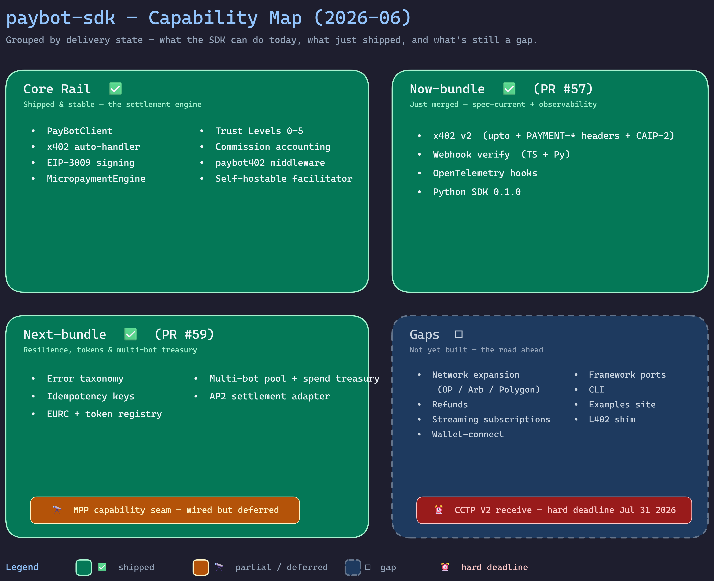
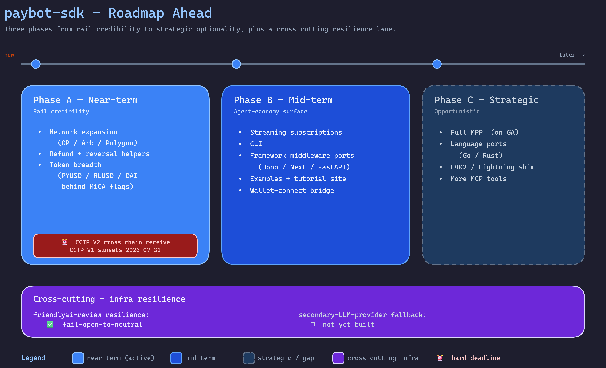

# paybot-sdk

USDC payments for bots via the [x402 protocol](https://www.x402.org/). One dependency (`viem`), 7 files, typed everything.

## Key Features

- **One dependency** (`viem`), 7 files, fully typed
- **Simple API** — register your bot and make payments in 2 lines of code
- **Network support** — Base and Base Sepolia (EIP155)
- **Mock mode** for testing without real transactions
- **MCP integration** — works with AI agent frameworks via [`paybot-mcp`](https://github.com/RBKunnela/paybot-mcp)
- **Self-hostable** facilitator service

## Architecture

```
PayBotClient → Facilitator (x402) → On-chain USDC (EIP-3009)
```

The SDK wraps payment logic for bots, handling registration, payment execution, and network configuration. Developers can use the hosted facilitator at `api.paybotcore.com` or run their own.

## Install

```bash
npm install paybot-sdk
```

## Quick Start

```typescript
import { PayBotClient } from 'paybot-sdk';

const client = new PayBotClient({
  apiKey: 'pb_test_...',
  botId: 'my-bot',
  facilitatorUrl: 'https://api.paybotcore.com',
});

// Register your bot
await client.register();

// Make a payment
const result = await client.pay({
  resource: 'https://api.example.com/data',
  amount: '0.01',
  payTo: '0x1234...abcd',
});

console.log(result.success, result.txHash);
```

## x402 Auto-Handler

Automatically pay for HTTP 402 responses:

```typescript
import { createX402Handler } from 'paybot-sdk';

const handler = createX402Handler({
  apiKey: 'pb_test_...',
  botId: 'my-bot',
  maxAutoPay: '1.00', // Max USD per auto-payment
});

// If the server returns 402, PayBot pays and retries automatically
const response = await handler.fetch('https://api.example.com/paid-endpoint');
const data = await response.json();
```

## Real Payments (EIP-3009)

Pass a wallet private key to sign actual on-chain USDC transfers:

```typescript
const client = new PayBotClient({
  apiKey: 'pb_...',
  botId: 'my-bot',
  walletPrivateKey: '0x...', // Signs EIP-3009 TransferWithAuthorization
});
```

## Trust Levels

PayBot enforces progressive trust levels that govern what your bot can do:

| Level | Name | Per-Tx Limit | Daily Limit |
|-------|------|-------------|-------------|
| 0 | Suspended | $0 | $0 |
| 1 | New | $1 | $10 |
| 2 | Basic | $10 | $100 |
| 3 | Verified | $100 | $1,000 |
| 4 | Trusted | $1,000 | $10,000 |
| 5 | Premium | $10,000 | $100,000 |

## SDK Methods

| Method | Description |
|--------|-------------|
| `client.pay(request)` | Execute a payment (verify + settle) |
| `client.register(trustLevel?)` | Register bot with facilitator |
| `client.balance()` | Get trust status and remaining budget |
| `client.history(limit?)` | Get transaction history |
| `client.setLimits(limits)` | Update spending limits |
| `client.health()` | Check facilitator health |

## Error Handling

Non-`pay()` methods throw `PayBotApiError` on failure:

```typescript
import { PayBotApiError } from 'paybot-sdk';

try {
  await client.balance();
} catch (err) {
  if (err instanceof PayBotApiError) {
    console.log(err.code);       // 'NOT_FOUND'
    console.log(err.statusCode); // 404
    console.log(err.details);    // { botId: 'unknown-bot' }
  }
}
```

`pay()` returns `PaymentResult` with `success: false` instead of throwing:

```typescript
const result = await client.pay({ ... });
if (!result.success) {
  console.log(result.error);        // Human-readable message
  console.log(result.errorCode);    // 'TRUST_VIOLATION'
  console.log(result.errorDetails); // { gate: 'SPENDING_ENVELOPE', ... }
}
```

## Network Configuration

```typescript
import { NETWORKS, getNetwork, getSupportedNetworks } from 'paybot-sdk';

// Available networks
console.log(getSupportedNetworks()); // ['eip155:8453', 'eip155:84532']

// Get network details
const baseSepolia = getNetwork('eip155:84532');
console.log(baseSepolia?.name); // 'Base Sepolia'
```

## Webhook Signature Verification

Verify inbound webhooks from the facilitator (HMAC-SHA256, constant-time compare, replay-window guard). No extra dependency — uses Node's built-in `crypto`.

```typescript
import { verifyWebhookSignature } from 'paybot-sdk';

app.post('/paybot/webhook', (req, res) => {
  const valid = verifyWebhookSignature({
    payload: req.rawBody,                       // raw string/Buffer, exactly as received
    signature: req.headers['paybot-signature'], // 't=<unix_ts>,v1=<hmac_hex>'
    secret: process.env.PAYBOT_WEBHOOK_SECRET,
    tolerance: 300,                             // optional replay window in seconds (default 300)
  });
  if (!valid) return res.status(400).send('invalid signature');
  // ...handle event
  res.sendStatus(200);
});
```

The signing string is `` `${t}.${payload}` ``; the same algorithm is implemented identically in the Python SDK, so a server-signed webhook verifies byte-for-byte in either runtime. `signWebhookPayload({ payload, secret })` produces a header value for TS-based senders and tests.

## OpenTelemetry (opt-in)

Pass any OpenTelemetry-compatible tracer to emit spans around the payment lifecycle. When no tracer is supplied, telemetry is a zero-overhead no-op — `@opentelemetry/api` is **not** a dependency of this SDK.

```typescript
import { trace } from '@opentelemetry/api';

const client = new PayBotClient({
  apiKey: 'pb_...',
  botId: 'my-bot',
  walletPrivateKey: '0x...',
  telemetry: { tracer: trace.getTracer('my-bot'), prefix: 'paybot.' },
});
```

Spans emitted per `pay()`: `paybot.client.pay`, `paybot.x402.sign`, `paybot.x402.challenge`, `paybot.x402.settle` — with `network`, `amount`, `bot_id`, `tx_hash`, and `success` attributes. A returned payment failure is an OK span with `success=false`; only thrown errors become span ERROR + `recordException`.

## x402 v2 conformance

Tracks the [x402-foundation](https://github.com/x402-foundation/x402) spec: v2 `PAYMENT-REQUIRED` / `PAYMENT-SIGNATURE` / `PAYMENT-RESPONSE` headers (the legacy `Payment-Intent` path still works), CAIP-2 network identifiers, and the `upto` (metered/usage) scheme alongside `exact`.

```typescript
import { parseCaip2, isSupportedCaip2 } from 'paybot-sdk';

parseCaip2('eip155:8453');        // { namespace: 'eip155', reference: '8453' }
isSupportedCaip2('eip155:8453');  // true

// 'upto' authorizes a capture ceiling; the facilitator settles the actual usage <= max.
// X402Handler.validateUptoCapture(authorizedMax, captured) throws UPTO_OVERCHARGE if exceeded.
```

## Tokens (USDC + EURC)

Pay in USDC (default) or EURC — both EIP-3009-capable on Base + Base Sepolia. The signing domain is resolved per-token, so EURC signs against its own contract.

```typescript
import { getToken, getSupportedTokens } from 'paybot-sdk';

getSupportedTokens();      // ['USDC', 'EURC']
getToken('EURC')?.symbol;  // 'EURC'

await client.pay({
  resource: 'https://api.example.com/data',
  amount: '0.50',
  payTo: '0x....',
  token: 'EURC',           // defaults to 'USDC'; unknown token → UNSUPPORTED_TOKEN
  network: 'eip155:84532', // EURC testnet ships in the public registry
});
```

### Mainnet token addresses (operator-supplied)

The public registry ships only addresses that are safe to distribute open-core
(e.g. testnet deployments). Mainnet addresses for regulated tokens are **not**
hardcoded in the SDK — inject them at runtime via `tokenAddressOverrides`
(`symbol → caip2Network → address`):

```typescript
const client = new PayBotClient({
  apiKey: 'pb_...',
  botId: 'my-bot',
  tokenAddressOverrides: {
    EURC: { 'eip155:8453': '0x...' }, // your EURC mainnet contract address
  },
});
```

Address resolution precedence: explicit `PaymentRequest.tokenContract` →
`tokenAddressOverrides[symbol][network]` → the public registry → otherwise a
`PaymentResult` failure with code `TOKEN_ADDRESS_NOT_CONFIGURED`. This keeps the
SDK from signing against a wrong or absent address when a mainnet token is not
configured.

## Error Taxonomy

`pay()` still returns `PaymentResult` (never throws). The other methods throw a typed hierarchy you can `instanceof`-switch on — all subclasses remain `instanceof PayBotApiError` for backward compatibility.

```typescript
import {
  PayBotError,            // abstract root
  PayBotApiError,         // HTTP-level (unchanged)
  PayBotNetworkError, PayBotTimeoutError, PayBotAuthError,
  PayBotPolicyError,      // trust/AML/daily-limit
  PayBotSignatureError, PayBotSettlementError,
} from 'paybot-sdk';

try {
  await client.balance();
} catch (err) {
  if (err instanceof PayBotPolicyError) { /* trust/limit gate */ }
  else if (err instanceof PayBotAuthError) { /* re-auth */ }
}
```

## Idempotency Keys

Pass an `idempotencyKey` to `pay()` / `register()` — sent as `X-Idempotency-Key` and deduped in a per-client LRU so a retried call doesn't double-bill.

```typescript
await client.pay({ resource, amount: '0.01', payTo, idempotencyKey: 'order_42_attempt_1' });
// A second call with the same key returns the cached result with no network round-trip.
```

## Multi-Bot Pool + Spend Treasury

Run many bots in one process from shared operator/transport config, each with its own signing key, under an optional shared daily spend ceiling.

```typescript
import { PayBotClientPool } from 'paybot-sdk';

const pool = new PayBotClientPool({
  apiKey: 'pb_...',
  operatorId: 'op_1',
  sharedDailyLimitUsd: 500,         // optional treasury across all bots
});
pool.addBot({ botId: 'bot-1', walletPrivateKey: '0x...' });
pool.addBot({ botId: 'bot-2', walletPrivateKey: '0x...' });

// payAs() blocks over-treasury BEFORE any network call (errorCode 'TREASURY_EXCEEDED')
const result = await pool.payAs('bot-1', { resource, amount: '12.00', payTo });
pool.remainingTreasuryUsd();        // 488 after a successful $12 spend
```

## AP2 + MPP

paybot is a clean x402 settlement engine, so a Google **AP2** (A2A x402-extension) mandate can settle through it directly. **MPP** (Stripe/Tempo) is still preview — the SDK ships only a detect-and-route capability seam, not a full client.

```typescript
import { Ap2Adapter, detectMppCapability } from 'paybot-sdk';

const ap2 = new Ap2Adapter(handler);              // handler: X402Handler
if (ap2.validateMandate(mandate).valid) {
  const receipt = await ap2.settle(mandate);      // signs + submits via x402
}

detectMppCapability(responseHeaders);             // { supported, mode: 'detect-only'|'none', specVersion? }
// createMppSeam().settle(...) throws MPP_NOT_IMPLEMENTED (501) — full MPP deferred until GA
```

> The AP2 adapter settles the payment; it does **not** verify the AP2 verifiable-credential signature — that stays in the mandate issuer's trust domain.

## Python SDK

A Python port lives in [`packages/python`](./packages/python) (`paybot-sdk` on PyPI, `>=3.10`). Mirrors the TS client surface, real EIP-3009 signing via `eth-account`, and the identical webhook verification contract.

```python
from paybot_sdk import PayBotClient, PayBotConfig, PaymentRequest, verify_webhook_signature

client = PayBotClient(PayBotConfig(api_key="pb_...", bot_id="my-bot", wallet_private_key="0x..."))
result = await client.pay(PaymentRequest(resource="https://api.example.com/data",
                                         amount="0.01", pay_to="0x...."))
```

## MCP Integration

For AI agent frameworks, use [paybot-mcp](https://github.com/RBKunnela/paybot-mcp) which wraps this SDK as an MCP server.

## Roadmap & Status

> **Legend:** ✅ shipped · 🟡 partial · 🔭 deferred (intentional) · ⬜ gap

**Capability map** — what the SDK can do today:



**Roadmap ahead** — the phased plan:



### What we've built

**Core rail (hardened):** `PayBotClient` (pay/balance/history/setLimits/register/health/commission/API-keys) · x402 auto-handler · EIP-3009 signing · `MicropaymentEngine` · trust levels 0–5 · commission accounting · `paybot402()` middleware · self-hostable facilitator · CI hardening (CodeQL, OSV, 80% coverage gate, SHA-pinned actions).

| Shipped | Gap ID |
|---------|--------|
| ✅ x402 **v2 conformance** — `upto` scheme, `PAYMENT-*` headers, CAIP-2 helpers | T1.1 + new |
| ✅ **Webhook signature verification** (TS + Python, byte-identical HMAC) | T1.2 |
| ✅ **Idempotency keys** (`X-Idempotency-Key` + LRU dedupe) | T1.3 |
| ✅ **Error taxonomy** (`PayBotError` + 6 typed subclasses) | T1.4 |
| ✅ **OpenTelemetry hooks** (opt-in, zero new deps) | T1.5 |
| ✅ **Multi-bot pool + spend treasury** | T1.6 |
| ✅ **EURC + token registry** (per-token EIP-712 domains) | T2.2 |
| ✅ **AP2 settlement adapter** · 🔭 thin **MPP capability seam** (deferred to GA) | T2.3 |
| ✅ **Python SDK 0.1.0** (real EIP-3009 signing) | T3.2 (partial) |

**Tier 1 (credibility blockers) is 100% complete** (T1.1–T1.6). Test posture: 331 TS tests / 98.66% coverage · 52 Python tests.

### Current gaps

- ⬜ **Network expansion (T2.1)** — still **Base + Base Sepolia only**; add Optimism / Arbitrum / Polygon.
- ⬜ **CCTP V2 cross-chain receive** — ⏰ *time-sensitive: Circle CCTP V1 deprecates 2026-07-31.*
- ⬜ **Refund + reversal helpers (T2.4)** · ⬜ **Streaming subscriptions (T2.5)** · ⬜ **Wallet-connect bridge (T2.6)**
- 🟡 **Token breadth** — USDC + EURC done; PYUSD / RLUSD / DAI not added (operator-gated).
- 🟡 **Language ports (T3.2)** — Python runtime shipped (middleware/x402-handler unported); Go / Rust not started.
- ⬜ **Framework ports (T3.1)** (Hono/Next/NestJS/FastAPI/Django) · ⬜ **CLI (T3.4)** · ⬜ **Examples + tutorial site (T3.5)** · ⬜ **More MCP tools (T3.3)** · ⬜ **L402 shim (T3.6)**
- 🔭 **Full MPP (T2.3)** — deliberately deferred; Stripe/Tempo MPP is still preview and shares no signing code with EIP-3009. Detect-only seam ships now.

### Roadmap ahead

Prioritized by internal gap severity × external leverage (EU-bank credibility, live distribution channels, hard deadlines).

**Phase A — Near-term (rail credibility):**
1. Network expansion (Optimism + Arbitrum + Polygon) — closes the biggest surface gap vs. Coinbase/Circle/Crossmint.
2. CCTP V2 cross-chain receive — ⏰ hard deadline (CCTP V1 dies 2026-07-31).
3. Refund + reversal helpers — table-stakes for real commerce.
4. Token breadth (PYUSD/RLUSD/DAI, operator-gated).

**Phase B — Mid-term (agent-economy surface):** streaming subscriptions · CLI · framework ports (Hono/Next/FastAPI first) · examples + tutorial site · wallet-connect bridge.

**Phase C — Strategic / opportunistic:** full MPP (on GA) · more language ports (Go/Rust) · L402/Lightning shim · more MCP tools.

**Strategic posture:** the moat is *self-hosted, non-custodial, MIT, trust-layer-in-the-SDK* — which custodial/portal-locked rivals (Coinbase Agentic Wallets, Circle, Crossmint, Payman) structurally cannot copy. Being a clean x402 settlement engine makes paybot AP2-pluggable and AgentCore-compatible today — so MPP can wait for GA.

## Deployment Options

### Option 1: Hosted (Recommended)

Use the hosted facilitator at `api.paybotcore.com` — no setup needed, ready to go:

```typescript
const client = new PayBotClient({
  apiKey: 'pb_test_...',
  botId: 'my-bot',
  facilitatorUrl: 'https://api.paybotcore.com',  // ← Hosted
});
```

### Option 2: Self-Hosted with Docker

For enterprise bots or custom networks, deploy your own PayBot facilitator with Docker (5 minutes):

```bash
git clone https://github.com/RBKunnela/paybot-core.git
cd paybot-core
docker compose up -d
```

Then configure your bot:

```typescript
const client = new PayBotClient({
  apiKey: 'pb_dev_...',
  botId: 'my-bot',
  facilitatorUrl: 'http://localhost:3000',  // ← Self-hosted
});
```

**Quick start guide**: See [SELF_HOSTING.md](./SELF_HOSTING.md) in this repository.

**Full deployment guide**: See [DEPLOYMENT.md](https://github.com/RBKunnela/paybot-core/blob/main/DEPLOYMENT.md) in paybot-core repository.

## License

[MIT](LICENSE)
