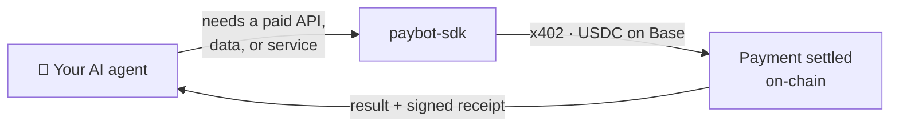
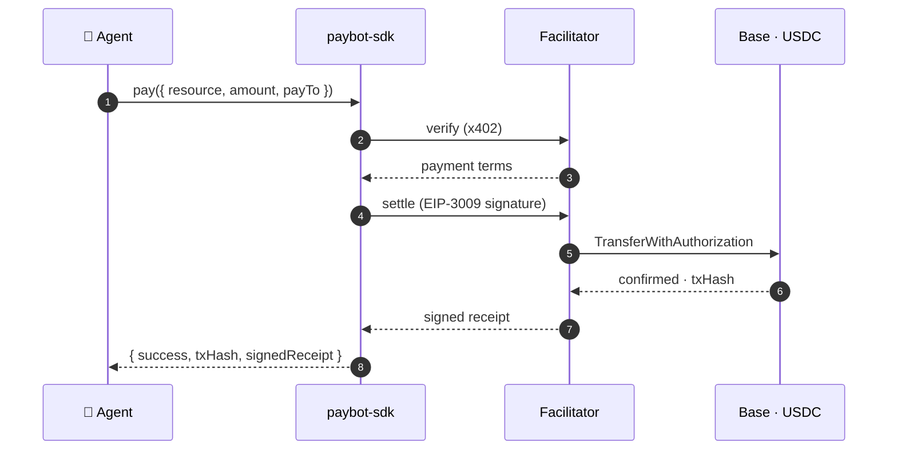
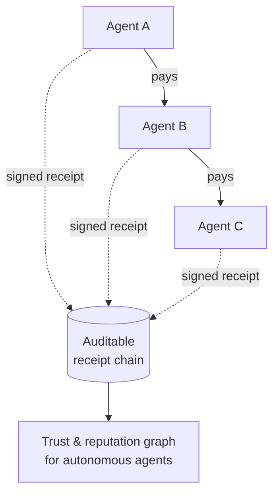

<div align="center">

# paybot-sdk

**Let your AI agent pay for things.** USDC payments for autonomous agents over the [x402 protocol](https://www.x402.org/) — one dependency, fully typed, TypeScript + Python.

[](https://www.npmjs.com/package/paybot-sdk)
[](https://github.com/RBKunnela/paybot-sdk/actions/workflows/ci.yml)
[](https://www.npmjs.com/package/paybot-sdk)
[](LICENSE)

</div>

---

## What it does

Your agent hits a paywalled API or service, and paybot-sdk settles it in USDC on Base — verify, pay, and get a signed receipt back — in two lines of code.



- **One dependency** (`viem`), 7 files, fully typed
- **Two-line API** — register your agent, make a payment
- **x402-native** — auto-pays HTTP `402` responses and retries
- **Base & Base Sepolia** (EIP-155), with mock mode for tests
- **Signed receipts** — verifiable proof of every payment
- **MCP integration** via [`paybot-mcp`](https://github.com/RBKunnela/paybot-mcp) for agent frameworks
- **Self-hostable** facilitator, or use the hosted one

## How a payment works



## Install

```bash
npm install paybot-sdk
```

## Quick Start

```typescript
import { PayBotClient } from 'paybot-sdk';

const client = new PayBotClient({
  apiKey: 'pb_test_...',
  botId: 'my-bot',
  facilitatorUrl: 'https://api.paybotcore.com',
});

// Register your bot
await client.register();

// Make a payment
const result = await client.pay({
  resource: 'https://api.example.com/data',
  amount: '0.01',
  payTo: '0x1234...abcd',
});

console.log(result.success, result.txHash);
```

## x402 Auto-Handler

Automatically pay for HTTP 402 responses:

```typescript
import { createX402Handler } from 'paybot-sdk';

const handler = createX402Handler({
  apiKey: 'pb_test_...',
  botId: 'my-bot',
  maxAutoPay: '1.00', // Max USD per auto-payment
});

// If the server returns 402, PayBot pays and retries automatically
const response = await handler.fetch('https://api.example.com/paid-endpoint');
const data = await response.json();
```

## Real Payments (EIP-3009)

Pass a wallet private key to sign actual on-chain USDC transfers:

```typescript
const client = new PayBotClient({
  apiKey: 'pb_...',
  botId: 'my-bot',
  walletPrivateKey: '0x...', // Signs EIP-3009 TransferWithAuthorization
});
```

## The bigger picture

PayBot is the payment rail for an **agent-to-agent economy**: agents that can pay each other autonomously, each transaction backed by a signed, verifiable receipt. Those receipts chain into an auditable record that agents can build **trust and reputation** on — so a buyer agent can tell a reliable counterparty from a bad one.



## Trust Levels

PayBot enforces progressive trust levels that govern what your bot can do:

| Level | Name | Per-Tx Limit | Daily Limit |
|-------|------|-------------|-------------|
| 0 | Suspended | $0 | $0 |
| 1 | New | $1 | $10 |
| 2 | Basic | $10 | $100 |
| 3 | Verified | $100 | $1,000 |
| 4 | Trusted | $1,000 | $10,000 |
| 5 | Premium | $10,000 | $100,000 |

## SDK Methods

| Method | Description |
|--------|-------------|
| `client.pay(request)` | Execute a payment (verify + settle) |
| `client.register(trustLevel?)` | Register bot with facilitator |
| `client.balance()` | Get trust status and remaining budget |
| `client.history(limit?)` | Get transaction history |
| `client.setLimits(limits)` | Update spending limits |
| `client.health()` | Check facilitator health |

## Error Handling

Non-`pay()` methods throw `PayBotApiError` on failure:

```typescript
import { PayBotApiError } from 'paybot-sdk';

try {
  await client.balance();
} catch (err) {
  if (err instanceof PayBotApiError) {
    console.log(err.code);       // 'NOT_FOUND'
    console.log(err.statusCode); // 404
    console.log(err.details);    // { botId: 'unknown-bot' }
  }
}
```

`pay()` returns `PaymentResult` with `success: false` instead of throwing:

```typescript
const result = await client.pay({ ... });
if (!result.success) {
  console.log(result.error);        // Human-readable message
  console.log(result.errorCode);    // 'TRUST_VIOLATION'
  console.log(result.errorDetails); // { gate: 'SPENDING_ENVELOPE', ... }
}
```

## Network Configuration

```typescript
import { NETWORKS, getNetwork, getSupportedNetworks } from 'paybot-sdk';

// Available networks
console.log(getSupportedNetworks()); // ['eip155:8453', 'eip155:84532']

// Get network details
const baseSepolia = getNetwork('eip155:84532');
console.log(baseSepolia?.name); // 'Base Sepolia'
```

## MCP Integration

For AI agent frameworks, use [paybot-mcp](https://github.com/RBKunnela/paybot-mcp) which wraps this SDK as an MCP server.

## Deployment Options

### Option 1: Hosted (Recommended)

Use the hosted facilitator at `api.paybotcore.com` — no setup needed, ready to go:

```typescript
const client = new PayBotClient({
  apiKey: 'pb_test_...',
  botId: 'my-bot',
  facilitatorUrl: 'https://api.paybotcore.com',  // ← Hosted
});
```

### Option 2: Self-Hosted with Docker

For enterprise bots or custom networks, deploy your own PayBot facilitator with Docker (5 minutes):

```bash
git clone https://github.com/RBKunnela/paybot-core.git
cd paybot-core
docker compose up -d
```

Then configure your bot:

```typescript
const client = new PayBotClient({
  apiKey: 'pb_dev_...',
  botId: 'my-bot',
  facilitatorUrl: 'http://localhost:3000',  // ← Self-hosted
});
```

**Quick start guide**: See [SELF_HOSTING.md](./SELF_HOSTING.md) in this repository.

**Full deployment guide**: See [DEPLOYMENT.md](https://github.com/RBKunnela/paybot-core/blob/main/DEPLOYMENT.md) in paybot-core repository.

## Contributing

PayBot is an open, MIT-licensed standard for agent payments, and contributions are welcome — start with [CONTRIBUTING.md](CONTRIBUTING.md) and the [`good first issue`](https://github.com/RBKunnela/paybot-sdk/labels/good%20first%20issue) list.

If paybot-sdk is useful to you, a ⭐ helps other builders find it.

## License

[MIT](LICENSE)
